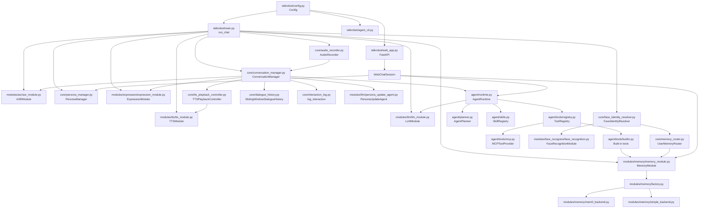
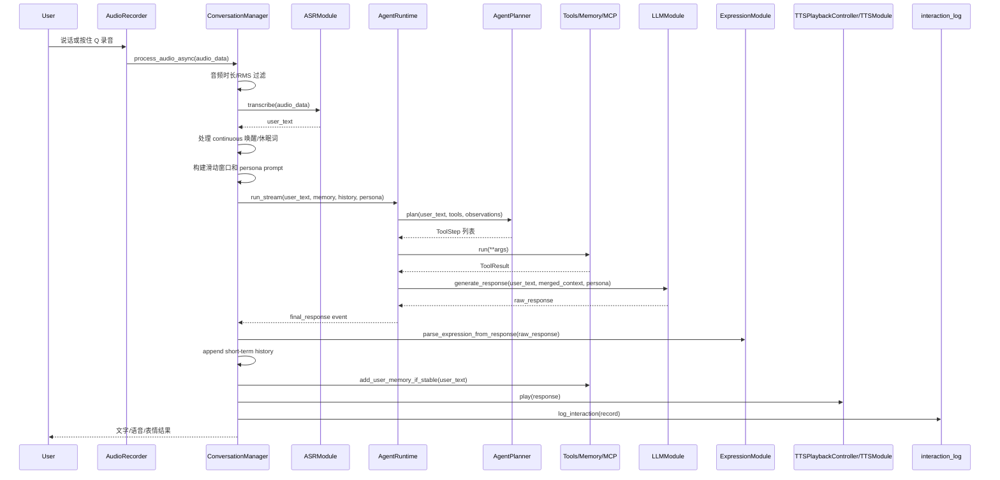

# Tyro / TalkRobot 代码结构说明

## 1. 项目一句话概述

Tyro / TalkRobot 是一个模块化语音与文本 AI 助手：把麦克风音频或终端/Web 文本输入，经过 ASR、人格提示词、短期历史、长期记忆、Agent 工具规划、LLM 生成、表情控制和 TTS 播放，最终输出回复。

主要入口有三个：

- `talkrobot/main.py`: 主语音/终端聊天入口，`python -m talkrobot.main` 或 `python -m talkrobot.main chat`。
- `talkrobot/web_app.py`: FastAPI Web UI 入口，`python -m talkrobot.web_app`。
- `talkrobot/agent_cli.py`: 纯文本 Agent 调试入口，安装后也暴露 `tyro-agent` 命令。

## 2. 目录结构树

```text
.
├── README.md
│   └── 项目使用说明，覆盖主程序、Agent CLI、记忆和运行参数。
├── pyproject.toml
│   └── Python 包元数据，定义包名 `tyro-talkrobot` 和脚本入口 `tyro-agent`。
├── requirements.txt
│   └── 运行依赖，包括 funasr、kokoro、openai、mem0、fastapi、mcp、torch 等。
├── record/
│   └── 录音示例与测试音频，不在主运行链路里。
├── expression/
│   └── 表情服务器相关脚本，主程序通过 `ExpressionServerManager` 启动。
├── expression_video/
│   └── 表情视频处理素材和脚本，偏资源/工具性质。
├── example/
│   └── ASR/TTS/LLM/Memory 的独立示例脚本和示例记忆库。
└── talkrobot/
    ├── main.py
    │   └── 主聊天 CLI：初始化配置、ASR、TTS、LLM、Memory、Persona、Face、Expression 和 `ConversationManager`。
    ├── web_app.py
    │   └── FastAPI Web UI：提供 `/api/chat`、`/api/memory`、`/api/memories` 等文本接口。
    ├── agent_cli.py
    │   └── Agent 命令行：`ask/chat/tools/skills/mcp`，用于调试工具规划和 ReAct 流程。
    ├── config.py
    │   └── 全局配置中心，从环境变量和 `.env` 读取模型、音频、记忆、人脸、表情等配置。
    ├── persona_profiles.json
    │   └── 按用户保存人格 system prompt，`PersonaManager` 会读取和更新它。
    ├── core/
    │   ├── conversation_manager.py
    │   │   └── 主对话编排器，串起 ASR 文本、AgentRuntime、表情、TTS、记忆写入和交互日志。
    │   ├── audio_recorder.py
    │   │   └── 麦克风录制器，支持按住 Q 录音和 Silero VAD 持续监听。
    │   ├── dialogue_history.py
    │   │   └── 每用户短期滑动窗口上下文。
    │   ├── memory_router.py
    │   │   └── 人脸驱动多用户模式下，根据用户动态提供长期记忆模块。
    │   ├── persona_manager.py
    │   │   └── 人格 prompt 的加载、回退和持久化更新。
    │   ├── face_identity_resolver.py
    │   │   └── 摄像头轮询和当前交互用户解析。
    │   ├── expression_server_manager.py
    │   │   └── 启停外部表情服务进程。
    │   ├── tts_playback_controller.py
    │   │   └── 播放 TTS 时屏蔽录音，并支持按 S 打断。
    │   ├── interaction_log.py
    │   │   └── 每轮交互 JSONL 日志，默认写到 `talkrobot/logs/interactions/`。
    │   └── app_logging.py
    │       └── loguru 控制台与按天文件日志配置。
    ├── modules/
    │   ├── asr/asr_module.py
    │   │   └── `ASRModule`，使用 FunASR `AutoModel` 把音频转文本。
    │   ├── llm/llm_module.py
    │   │   └── `LLMModule`，封装 OpenAI-compatible Chat Completions 同步与流式调用。
    │   ├── llm/persona_update_agent.py
    │   │   └── 后台人格更新 Agent，用情绪门控和 LLM 判断是否改写用户人格 prompt。
    │   ├── tts/tts_module.py
    │   │   └── `TTSModule`，支持 Kokoro 和 easy_tts_server，并可播放流式文本。
    │   ├── memory/
    │   │   ├── memory_module.py
    │   │   │   └── 长期记忆 facade，对外保持 `add/search/get_all/shutdown` API。
    │   │   ├── base.py
    │   │   │   └── `MemoryBackend` 抽象和 `MemoryRecord` 数据结构。
    │   │   ├── factory.py
    │   │   │   └── 根据 provider 创建 mem0 或本地 JSON 记忆后端。
    │   │   ├── mem0_backend.py
    │   │   │   └── mem0 适配器，使用向量库检索长期记忆。
    │   │   ├── simple_backend.py
    │   │   │   └── 本地 JSON 后端，适合测试和离线开发。
    │   │   └── filters.py
    │   │       └── 判断用户输入是否适合作为稳定记忆。
    │   ├── expression/expression_module.py
    │   │   └── 表情 HTTP 客户端，解析 `[expression:xxx]` 并调用表情服务器。
    │   └── face_recognize/face_recognition.py
    │       └── InsightFace 人脸识别、中心人脸追踪和可选 ROS2 topic 发布。
    ├── agent/
    │   ├── runtime.py
    │   │   └── `AgentRuntime`，执行规划、工具调用、技能注入、ReAct 循环和最终 LLM 回复。
    │   ├── planner.py
    │   │   └── `AgentPlanner`，支持 LLM planner 和规则 planner，输出 `ToolStep`。
    │   ├── events.py
    │   │   └── `AgentEvent`，把 plan/tool/llm/final 等阶段作为事件流返回。
    │   ├── skills.py
    │   │   └── 加载 `SKILL.md`，按触发词或计划工具匹配技能说明。
    │   ├── tools/
    │   │   ├── base.py
    │   │   │   └── Tool 接口：`BaseTool`、`ToolResult`、`RuntimeToolContext`。
    │   │   ├── builtin.py
    │   │   │   └── 内置工具：记忆搜索/写入、时间、计算器、项目文件读写、网页读取。
    │   │   ├── registry.py
    │   │   │   └── `ToolRegistry` 聚合内置工具和 MCP 工具。
    │   │   └── mcp.py
    │   │       └── MCP stdio 工具适配器，从 JSON 配置加载外部工具。
    │   ├── mcp_servers.json
    │   │   └── 默认 MCP 工具配置。
    │   ├── mcp_servers/dev_tools.py
    │   │   └── 实验 MCP server，提供 git、SQLite、fetch_url 等开发工具。
    │   └── skills/*/SKILL.md
    │       └── 内置 Agent 技能说明，例如项目阅读、代码审查、本地数据分析。
    ├── web/static/
    │   └── Web UI 前端静态资源，`web_app.py` 挂载到 `/static`。
    ├── docs/
    │   └── 细分文档，如 MCP、Agent CLI、Memory、ASR、Audio Recorder 等。
    └── tests/
        └── 单元/集成测试，覆盖 Agent、记忆、ASR/TTS/LLM、人格、音频录制等。
```

## 3. 核心模块说明

### CLI 启动与应用装配

- 模块名：主程序入口。
- 负责什么：解析命令行，读取 `Config`，实例化所有运行模块，然后交给 `ConversationManager`。
- 主要文件：`talkrobot/main.py`。
- 对外能力：`main()`、`run_chat(args)`、`run_add_memory(args)`。
- 依赖模块：`Config`、`configure_logging`、`ASRModule`、`TTSModule`、`LLMModule`、`MemoryModule`、`PersonaManager`、`PersonaUpdateAgent`、`ExpressionModule`、`FaceIdentityResolver`、`UserMemoryRouter`、`AudioRecorder`、`ConversationManager`。

### 对话编排核心

- 模块名：Conversation Core。
- 负责什么：接收音频或文本，做输入过滤、用户切换、短期上下文、Agent 运行、表情解析、TTS 播放、长期记忆写入、交互日志。
- 主要文件：`talkrobot/core/conversation_manager.py`。
- 对外能力：`ConversationManager.process_audio()`、`process_audio_async()`、`process_text()`、`switch_active_user()`、`on_face_user_change()`、`shutdown()`。
- 依赖模块：ASR/TTS/LLM/Memory 模块、`AgentRuntime`、`SlidingWindowDialogueHistory`、`TTSPlaybackController`、`ExpressionModule`、`log_interaction`。

### Agent Runtime / Tools / Skills

- 模块名：轻量 Agent 子系统。
- 负责什么：根据用户输入规划工具，执行工具，把工具结果和技能说明合并进上下文，再让 LLM 生成最终回复。
- 主要文件：`talkrobot/agent/runtime.py`、`planner.py`、`events.py`、`skills.py`、`tools/*.py`。
- 对外能力：`AgentRuntime.run_stream()` 返回 `AgentEvent` 事件流；`ToolRegistry.default()` 注册工具；`AgentPlanner.plan()` 输出 `AgentPlan`。
- 依赖模块：`LLMModule` 或任何实现 `generate_response()` 的对象、`MemoryModule`、内置工具、MCP 工具配置、`SKILL.md`。

### ASR 音频输入

- 模块名：语音输入。
- 负责什么：从麦克风采集音频，并用 FunASR 转成文本。
- 主要文件：`talkrobot/core/audio_recorder.py`、`talkrobot/modules/asr/asr_module.py`。
- 对外能力：`AudioRecorder.start(on_audio_complete)`、`AudioRecorder.notify_process_done()`、`ASRModule.transcribe(audio_data)`。
- 依赖模块：`sounddevice`、`pynput`、`silero_vad`、`funasr.AutoModel`。

### LLM 回复生成

- 模块名：LLM 模块。
- 负责什么：构建 system/context/user messages，调用 OpenAI-compatible Chat Completions，支持普通和流式回复。
- 主要文件：`talkrobot/modules/llm/llm_module.py`。
- 对外能力：`LLMModule.generate_response()`、`generate_response_stream()`；同时暴露 `client` 给 `PersonaUpdateAgent` 复用。
- 依赖模块：`openai.OpenAI`、`Config.LLM_*`、来自 AgentRuntime 的上下文。

### TTS 语音输出

- 模块名：语音合成与播放。
- 负责什么：把回复文本合成音频并播放，支持普通字符串和流式迭代器输入。
- 主要文件：`talkrobot/modules/tts/tts_module.py`、`talkrobot/core/tts_playback_controller.py`。
- 对外能力：`TTSModule.synthesize()`、`save_audio()`、`stop()`、`interrupt()`；`TTSPlaybackController.play()`。
- 依赖模块：`kokoro.KPipeline` 或 `easy_tts_server.create_tts_engine`、`sounddevice`、`pynput`。

### 长期记忆

- 模块名：Memory。
- 负责什么：用统一 facade 封装长期记忆写入、检索和列举，底层可切换 mem0 或本地 JSON。
- 主要文件：`talkrobot/modules/memory/memory_module.py`、`base.py`、`factory.py`、`mem0_backend.py`、`simple_backend.py`、`filters.py`。
- 对外能力：`MemoryModule.add_memory()`、`add_user_memory_if_stable()`、`search_memory()`、`get_all_memories()`、`shutdown()`。
- 依赖模块：`Config.get_memory_config()`、mem0、Chroma/OpenAI-compatible embedding 配置，或 `SimpleJsonMemoryBackend`。

### 人格 Prompt 与自动更新

- 模块名：Persona。
- 负责什么：按用户读取人格 prompt，合并全局 prompt 和表情 prompt；可在对话后异步更新用户人格。
- 主要文件：`talkrobot/core/persona_manager.py`、`talkrobot/modules/llm/persona_update_agent.py`、`talkrobot/persona_profiles.json`。
- 对外能力：`PersonaManager.get_prompt_for_user()`、`update_user_prompt()`；`PersonaUpdateAgent.run()`。
- 依赖模块：`LLMModule.client`、`transformers` 情绪模型、`Config.PERSONA_*`。

### 表情控制

- 模块名：Expression。
- 负责什么：让 LLM 在回复前缀产生 `[expression:xxx]`，解析后调用表情服务器切换表情。
- 主要文件：`talkrobot/modules/expression/expression_module.py`、`talkrobot/core/expression_server_manager.py`、`expression/expression_server.py`。
- 对外能力：`ExpressionModule.get_expression_prompt()`、`parse_expression_from_response()`、`set_expression()`、`reset_expression()`。
- 依赖模块：HTTP 表情服务，`Config.EXPRESSION_*`。

### 人脸驱动多用户

- 模块名：Face Identity。
- 负责什么：识别当前摄像头画面里的用户，自动切换对话对象和对应记忆。
- 主要文件：`talkrobot/core/face_identity_resolver.py`、`talkrobot/modules/face_recognize/face_recognition.py`、`talkrobot/core/memory_router.py`。
- 对外能力：`FaceIdentityResolver.resolve_user()`、`set_on_user_change()`、`is_current_user_familiar()`；`UserMemoryRouter.get_memory_for_user()`。
- 依赖模块：OpenCV、InsightFace、known faces 目录、可选 ROS2。

### Web UI

- 模块名：Web 应用。
- 负责什么：提供文本聊天、记忆添加/列举、历史清空接口，并复用 Agent、Memory、Persona、日志。
- 主要文件：`talkrobot/web_app.py`、`talkrobot/web/static/*`。
- 对外能力：FastAPI 路由 `/api/chat`、`/api/memory`、`/api/memories`、`/api/history/clear`；`WebChatSession.chat()`。
- 依赖模块：`AgentRuntime`、`SlidingWindowDialogueHistory`、`PersonaManager`、`MemoryModule`、OpenAI client。

## 4. 程序启动流程

### 主语音/终端聊天

`python -m talkrobot.main`
→ `talkrobot/main.py:main()`
→ argparse 解析 `chat` / `add-memory`，无子命令时兼容旧参数并默认进入聊天
→ `run_chat(args)`
→ `configure_logging(debug=Config.DEBUG)`
→ 按 `--language` 选择 `Config.SYSTEM_PROMPT` / `SYSTEM_PROMPT_EN` 和全局 prompt
→ 可选初始化 `ASRModule`
→ 初始化 `TTSModule`
→ 若 `Config.EXPRESSION_ENABLED`，通过 `ExpressionServerManager.start()` 启动表情服务并创建 `ExpressionModule`
→ 初始化 `LLMModule`
→ 初始化 `PersonaManager`，可选初始化 `PersonaUpdateAgent`
→ 若 `--enable-face`，初始化 `FaceIdentityResolver` 和 `UserMemoryRouter`
→ 否则初始化固定用户的 `MemoryModule`
→ 若启用 ASR，初始化 `AudioRecorder`
→ 创建 `ConversationManager`
→ 若启用人脸，注册 `face_resolver.set_on_user_change(conversation_manager.on_face_user_change)`
→ `--no-asr` 时进入终端输入循环并调用 `conversation_manager.process_text()`
→ 否则 `audio_recorder.start(on_audio_complete=conversation_manager.process_audio_async)`
→ 退出时依次停止 TTS、录音、ConversationManager、Memory、Face、Expression server。

### Web UI

`python -m talkrobot.web_app`
→ `web_app.py` 模块加载时执行 `configure_logging()` 和 `_drop_unsupported_proxy_env()`
→ 创建全局 `store = SessionStore()`
→ 创建 `app = FastAPI(...)`
→ 挂载 `/static`
→ `main()` 调用 `uvicorn.run("talkrobot.web_app:app", host, port)`
→ 请求 `/api/chat`
→ `SessionStore.get()` 按 `(user, language, history_rounds, use_memory)` 复用或创建 `WebChatSession`
→ `WebChatSession.__init__()` 初始化 persona、OpenAI client、AgentRuntime、可选 MemoryModule
→ `WebChatSession.chat()` 执行 AgentRuntime 并返回 JSON。

### Agent CLI

`python -m talkrobot.agent_cli ask "..."` 或 `tyro-agent ask "..."`
→ `agent_cli.py:main()`
→ `build_parser()` 解析 `ask/chat/tools/skills/mcp`
→ `command_ask()` 或 `command_chat()`
→ `run_agent_turn()`
→ `build_runtime()` 创建 `AgentRuntime`
→ `build_llm()` 创建 `LLMModule`
→ `build_memory()` 按参数创建长期记忆或关闭
→ `AgentRuntime.run_stream()`
→ `emit_answer()` 输出回复或 JSON。

## 5. 关键调用链

### 语音对话主链路

```text
User speaks
→ AudioRecorder.audio_callback()
→ AudioRecorder.on_release() 或 AudioRecorder._vad_monitor_loop()
→ ConversationManager.process_audio_async()
→ ConversationManager.process_audio()
→ ASRModule.transcribe()
→ ConversationManager._handle_continuous_mode_command()
→ ConversationManager._process_user_text()
→ AgentRuntime.run_stream()
→ AgentPlanner.plan()
→ ToolRegistry.build_tools()
→ MemorySearchTool / CurrentTimeTool / CalculatorTool / ProjectFileReadTool / MCPTool ...
→ LLMModule.generate_response() 或 generate_response_stream()
→ ExpressionModule.parse_expression_from_response()
→ SlidingWindowDialogueHistory.append()
→ MemoryModule.add_user_memory_if_stable()
→ TTSPlaybackController.play()
→ TTSModule.synthesize()
→ log_interaction()
```

### Web 文本聊天链路

```text
Browser POST /api/chat
→ talkrobot/web_app.py:chat(payload)
→ SessionStore.get()
→ WebChatSession.chat()
→ SlidingWindowDialogueHistory.build_context()
→ WebChatSession._persona_prompt()
→ AgentRuntime.run_stream(llm=self, memory_module=self._memory)
→ WebChatSession.generate_response()
→ OpenAI.chat.completions.create()
→ _parse_expression()
→ SlidingWindowDialogueHistory.append()
→ MemoryModule.add_user_memory_if_stable()
→ log_interaction()
→ JSON response
```

### 人脸切换用户与记忆链路

```text
FaceIdentityResolver._tracking_loop()
→ FaceIdentityResolver._detect_user_once()
→ FaceRecognitionModule.process_frame()
→ FaceIdentityResolver.set_on_user_change(callback)
→ ConversationManager.on_face_user_change(user, is_familiar)
→ ConversationManager._switch_user_if_needed()
→ UserMemoryRouter.get_memory_for_user()
→ Config.has_persistent_memory()
→ MemoryModule(...) 或 None
→ SlidingWindowDialogueHistory.clear(previous_user)
→ 后续 AgentRuntime.run_stream(long_term_memory=当前用户是否有长期记忆)
```

### 显式记忆写入链路

```text
User says "帮我记住..."
→ ConversationManager._process_user_text()
→ AgentRuntime.run_stream()
→ AgentPlanner.plan()
→ ToolStep(tool="memory_write")
→ MemoryWriteTool.run()
→ MemoryModule.add_user_memory_if_stable()
→ MemoryModule.add_memory(async_mode=True)
→ MemoryModule._add_memory_sync()
→ Mem0MemoryBackend.add() 或 SimpleJsonMemoryBackend.add()
```

## 6. 数据流 / 状态流

### 音频数据

- 创建位置：`AudioRecorder.audio_callback()` 从 `sounddevice.InputStream` 接收 `indata`。
- 转换位置：push 模式在 `on_release()` 合并 `audio_frames`；continuous 模式在 `_vad_monitor_loop()` 用 Silero VAD 切出语音段。
- 使用位置：`ConversationManager.process_audio()` 做时长/RMS 过滤，再传给 `ASRModule.transcribe()`。
- 输出位置：ASR 文本进入 `_process_user_text()`；音频元数据写入 `log_interaction()`。

### 用户文本

- 创建位置：ASR 输出，或 `main.py` no-asr 输入循环，或 Web/Agent CLI 请求。
- 转换位置：continuous 模式下 `_normalize_text()` 用于唤醒词/休眠词判断；Agent planner 也会解析文本中的时间、URL、文件路径、数学表达式。
- 使用位置：`AgentRuntime.run_stream(user_text=...)`，作为工具规划和最终 LLM 用户消息。
- 保存位置：短期历史由 `SlidingWindowDialogueHistory.append()` 保存；稳定长期信息由 `MemoryModule.add_user_memory_if_stable()` 异步写入。

### 上下文数据

- 短期上下文：`SlidingWindowDialogueHistory.build_context(user)` 生成“最近对话窗口”文本。
- 长期记忆上下文：`MemorySearchTool.run()` 调用 `MemoryModule.search_memory()`，再格式化为编号列表。
- 工具上下文：`AgentRuntime.run_stream()` 把每个成功工具的 `ToolResult.content` 放进 `tool_context_parts`。
- 用户切换提示：`ConversationManager._switch_user_if_needed()` 生成一次性 `switch_notice`，`_consume_user_switch_notice()` 后进入 LLM 上下文。
- 最终合并：`AgentRuntime._merge_context()` 合并 `switch_notice`、工具结果、短期历史，传入 `LLMModule.generate_response()`。

### 人格 Prompt

- 创建/读取位置：`PersonaManager.reload()` 从 `talkrobot/persona_profiles.json` 读取。
- 合并位置：`main.py` 内部 `_persona_provider(current_user)` 把用户 prompt、`Config.GLOBAL_SYSTEM_PROMPT`、表情 prompt 拼接。
- 使用位置：`ConversationManager._process_user_text()` 把它作为 `system_prompt_override` 传给 `AgentRuntime.run_stream()`。
- 更新位置：当前轮回复生成后，`_start_persona_update_async()` 后台调用 `PersonaUpdateAgent.run()`；如需更新，`PersonaManager.update_user_prompt()` 原子写回 JSON。

### Agent 事件流

- 创建位置：`AgentRuntime.run_stream()` 依次 yield `plan`、`skill_loaded`、`tool_start`、`tool_result`、`llm_start`、`llm_chunk`、`final_response`。
- 消费位置：CLI 主链路由 `ConversationManager._handle_agent_event()` 打印或播报状态；Web 只关心 `final_response` 和错误；Agent CLI 可通过 `--show-events` 打印。
- 输出位置：`final_response.data` 包含 `context`、`tool_results`、`observations`、`used_memory`、`used_tools`、`used_skills`、耗时等。

### 长期记忆数据

- mem0 后端：`Config.get_memory_config(user)` 指向 `talkrobot/mem_db/<user>` 的 Chroma 向量库路径。
- simple 后端：`SimpleJsonMemoryBackend` 写到 `Config.get_simple_memory_path()` 下的 `user_xxx.json`。
- 自动写入策略：`MemoryModule.add_user_memory_if_stable()` 先用 `filters.py` 判断是否是稳定用户信息，不是每句都写。
- 人脸多用户策略：`UserMemoryRouter.get_memory_for_user()` 只有在 `Config.has_persistent_memory(user)` 为真时才创建长期记忆，否则该用户只用滑动窗口。

### 日志数据

- 应用日志：`configure_logging()` 写 `talkrobot/logs/robot_YYYY-MM-DD.log`。
- 交互日志：`log_interaction()` 写 `talkrobot/logs/interactions/interactions_YYYY-MM-DD.jsonl`。
- 交互日志包含输入模式、用户、语言、上下文、工具结果、TTS 状态、耗时和错误信息。

## 7. 我最应该先读哪些文件

1. `README.md`
   - 先建立运行方式和功能边界，知道主程序、Web UI、Agent CLI 分别怎么启动。

2. `talkrobot/config.py`
   - 所有默认行为几乎都从这里来：模型、API、TTS provider、记忆 provider、表情、人脸、滑动窗口。

3. `talkrobot/main.py`
   - 这是完整语音助手的“装配图”，`run_chat()` 能看到模块如何被创建和连接。

4. `talkrobot/core/conversation_manager.py`
   - 最重要的业务编排文件，重点读 `process_audio()`、`process_text()`、`_process_user_text()`。

5. `talkrobot/agent/runtime.py`
   - 当前回复生成实际经过 AgentRuntime，而不是直接调用 LLM；这里决定上下文如何由工具结果组成。

6. `talkrobot/agent/planner.py`
   - 理解为什么某些用户输入会触发记忆、时间、计算器、文件、网页或 MCP 工具。

7. `talkrobot/agent/tools/builtin.py`
   - 看清内置工具的真实能力和安全边界，比如项目文件读取只能在 project root 内。

8. `talkrobot/modules/memory/memory_module.py`
   - 了解长期记忆 facade，以及自动写入“稳定记忆”的时机。

9. `talkrobot/web_app.py`
   - 如果要做 UI 或 API 开发，读 `WebChatSession.chat()` 和 FastAPI 路由。

10. `talkrobot/core/audio_recorder.py`
    - 如果要改语音输入、VAD、按键录音或 TTS 防回声逻辑，读这个。

## 8. 容易困惑的地方

- “LLM 生成”并不总是直接从 `ConversationManager` 调 `LLMModule.generate_response()`；正常链路会先进入 `AgentRuntime.run_stream()`，由 planner 决定是否调用工具，再把工具结果合入上下文。

- `MemoryModule` 是 facade，不是具体数据库。真正后端由 `Config.MEMORY_PROVIDER` 决定：`mem0` 走 `Mem0MemoryBackend`，`simple/json/local` 走 `SimpleJsonMemoryBackend`。

- 长期记忆不会把每轮对话都保存。`ConversationManager._process_user_text()` 只在回复后调用 `add_user_memory_if_stable()`，显式“记住”类请求则可能由 `MemoryWriteTool` 写入。

- 短期历史和长期记忆是两条状态流。短期历史在 `SlidingWindowDialogueHistory` 内存中按用户保存；长期记忆落盘到 mem0/JSON。

- 人脸多用户模式下，未发现持久记忆的用户不会自动创建长期记忆模块。`UserMemoryRouter.get_memory_for_user()` 会返回 `(None, False)`，此时只用滑动窗口。

- `PersonaManager` 支持两种 JSON 结构：根对象直接按用户存，也支持 `{"users": {...}}`。新人改 `persona_profiles.json` 时要注意 `update_user_prompt()` 会尽量保持已有结构。

- 表情是 prompt 约定加 HTTP 调用，不是 LLM API 的结构化字段。LLM 回复里的 `[expression:xxx]` 会被 `ExpressionModule.parse_expression_from_response()` 或 Web 的 `_parse_expression()` 从正文剥离。

- `Config.DEBUG` 来自环境变量，但 `main.py` 也有 `--debug` 参数。当前阅读到的 `run_chat()` 使用 `configure_logging(debug=Config.DEBUG)`，不确定 `--debug` 是否在后续 argparse 兼容逻辑中回写了 `Config.DEBUG`；需要继续看 `talkrobot/main.py` 末尾参数处理部分确认。

- `web_app.py` 里的 `WebChatSession` 自己实现了 `generate_response()`，并把 `self` 作为 LLM 对象传给 `AgentRuntime.run_stream()`；这和 CLI 的 `LLMModule` 是同一个接口形状，但不是同一个类。

- MCP 工具默认配置路径由 `ToolRegistry.default(project_root)` 查 `project_root/talkrobot/agent/mcp_servers.json`，Agent CLI 的 `--project-root` 会影响这个路径；主语音链路里 `ConversationManager` 用仓库根目录初始化 `AgentRuntime`。

- `TTSPlaybackController.play()` 会设置 `audio_recorder.is_tts_playing = True`，continuous 模式的 `AudioRecorder.audio_callback()` 会据此跳过采集，避免机器人听到自己。

## 9. Mermaid 图

### 模块关系图



### 核心调用流程图



